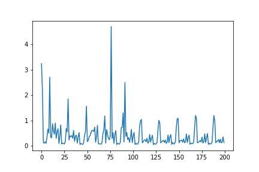

## FesNet for solving PDE which based on finite-element in Seismic

# Model

# Train 

    Dataset Para:
        super_element_dim = 294,
        super_step_size = 1000,
        super_step_t = 0.5, 
        super_hot_start = 1/35, 
        super_size=31,
        path = "./data/"
        

    Train para:
        Adam,StepLR
        lr = 0.002
        hidden_dim = 400
        logits_size = 10
        num_layers = 2
        epoch = 10
        max_length = 10
        clip_threh = 0.5
        step_size = 5
        gamma = 0.5

    

# Predict 

Test_dataset:
Time Cost:  5.15300178527832 s
Time Cost:  3.7200005054473877 s
Time Cost:  3.778003692626953 s
Time Cost:  4.040002107620239 s
Time Cost:  3.366999626159668 s
Time Cost:  3.7520222663879395 s
Time Cost:  3.792003870010376 s
Time Cost:  3.3139984607696533 s

        Teacher-Forcing   Self-Regression
    MSE : 4.136940627009608, 4.143258782220073
    R2  : 0.6857                  0.6852

demo:
Perfect one:

Bad one:

